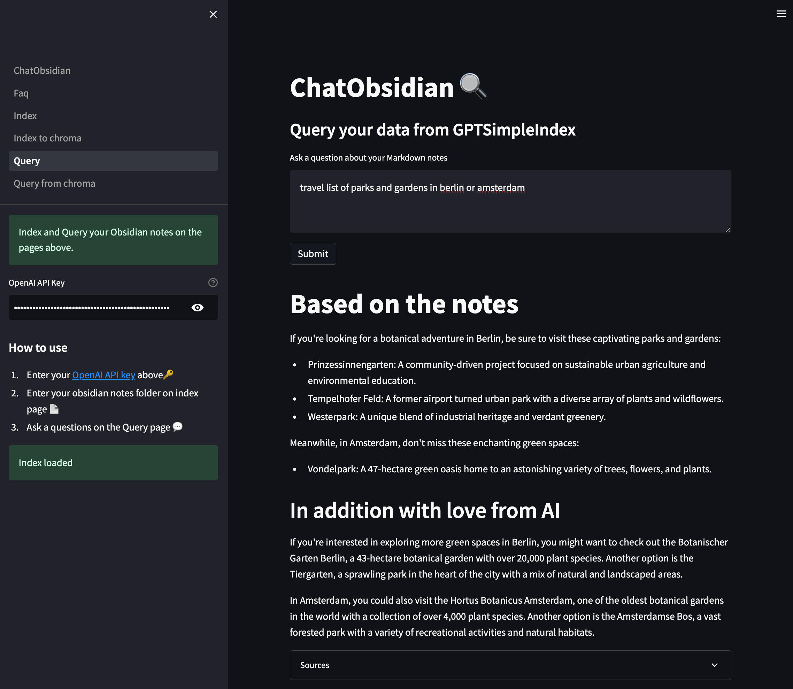

# ChatObsidian
  


ChatObsidian is an Question and Answer AI integration for a folder of markdown notes.  
Intended for Obsidian notes vault, but you could use it for any local folder of markdown files.  
This app is for private use only. you can't upload files, and you should not run it in public. maybe on a closed local network, but even then maybe add basic auth or something.  

This is very much a work in progress project, but some parts work ok already:  

- index/query with chromadb and gptsimpleindex works correctly. Tested with up to 10000 notes in Obsidian vault. will likely remove gptsimple soon, as chroma works well now.
- notes are indexed locally, so they're not all sent to OpenAI.
- Semantic Search is local only, so does not require OpenAI key... indexing doesn't use it either, so any string prob works. 
- ...but notes related to each Query from Query page are sent to OpenAI API for final synthesis. If you think this is a privacy issue, then don't use it. [OpenAI data policy](https://openai.com/policies/api-data-usage-policies)


---  
  
run locally with

```bash
pipenv shell \
pipenv install \
export OPENAI_API_KEY=YOUR_API_KEY \
streamlit run ChatObsidian.py
```

### TODO

- [x] vector database integration (chroma)
- [x] gpt3.5-turbo support (cost reduction)
- [x] local embeddings model support (langchain/huggingface) (cost reduction, privacy)
- [x] open sources in obsidian via uri
- [ ] refresh files, instead of delete and reindex
- [x] just semantic search of files (no_text config)
- [ ] local LLM support (free, privacy) Explore Alpaca 7B, when it becomes available in LangChain
- [ ] select and configure LLM on sidebar (model and prompthelper)
- [ ] pdf support
- [ ] image support
- [ ] docker support (folder mapping would suck a bit. maybe map to a default './data/obsidianvault')
- [ ] multi collection support (collection per vault folder? select which folders to index)
